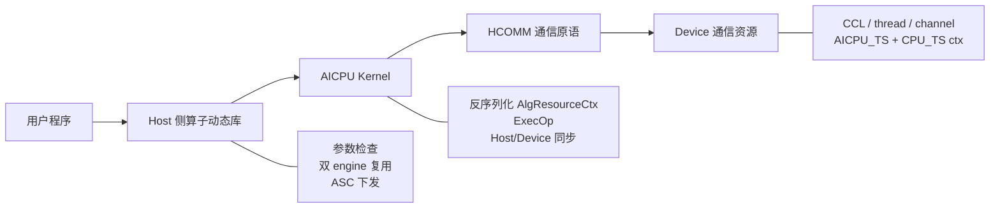
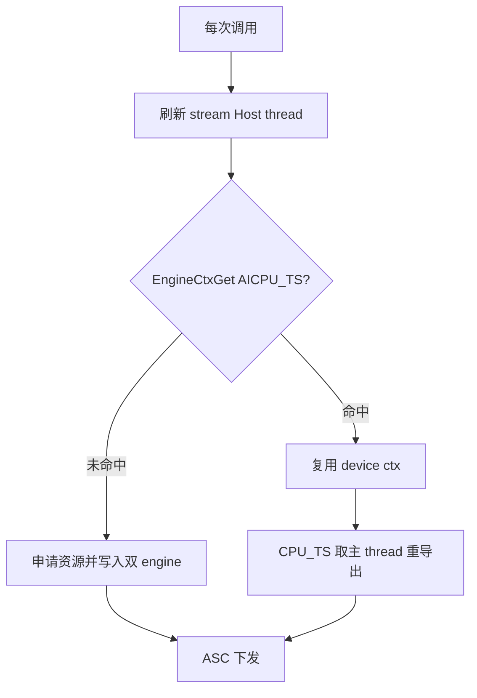
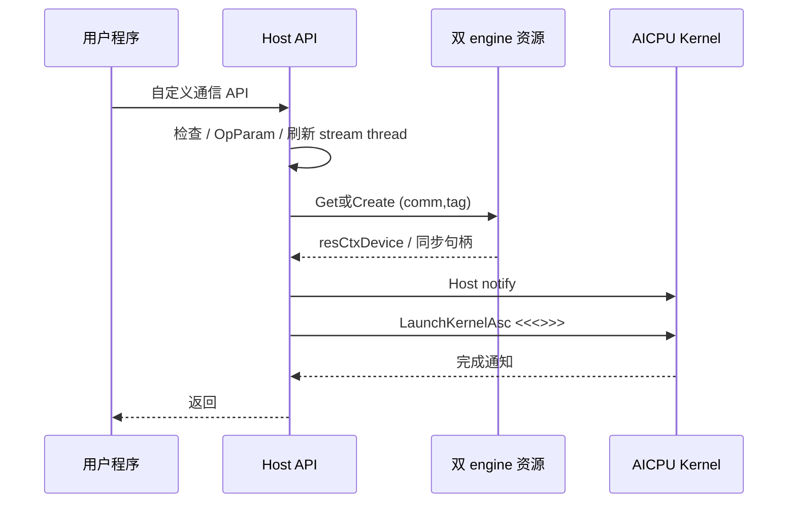
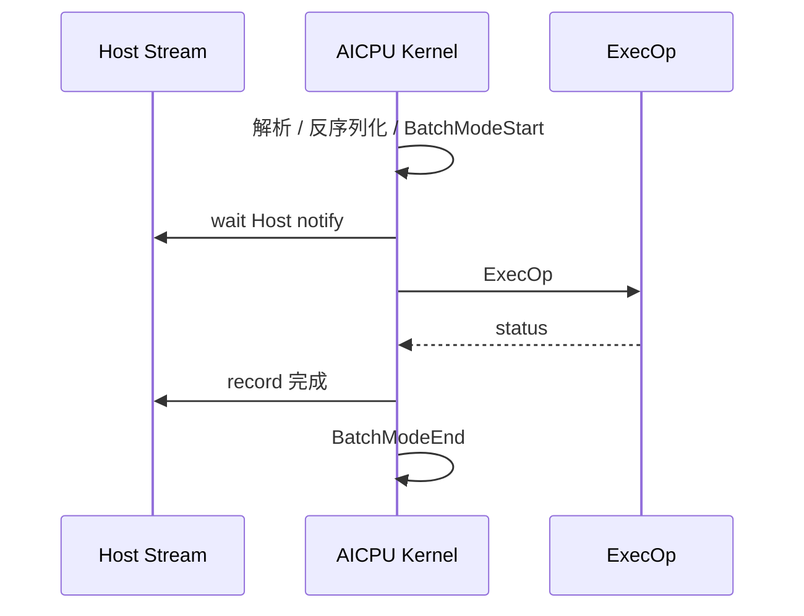

# AICPU 自定义通信算子设计指导文档

> 基于 `examples/05_custom_ops_allgather/aicpu` 抽象，并对照 `examples/04_custom_ops_p2p` 修正资源与平台差异。  
> 目标：指导 Broadcast / ReduceScatter / AllReduce / AllToAll / SendRecv 等自定义通信算子的方案设计、代码组织与评审。

---

## 0. 串讲摘要、硬约束与范围

一句话：**Host 负责参数检查、通信域级资源准备与 ASC 下发；AICPU 负责基于 HCOMM 原语执行通信编排；可复用资源按 `(comm, tag, engine)` 缓存，stream 绑定同步句柄每次调用刷新。**

### 0.1 串讲结构（6 页）

| 页 | 讲什么 | 对应章节 | 听众带走的结论 |
|---|---|---|---|
| 1 | 目标与分层框架（L0~L3） | §0~§1 | 不是“一套 ExecOp 打天下”，而是骨架 + 拓扑 + 算子 + 平台 |
| 2 | 接口、参数与资源真相表 | §2 | 双 engine、tag 缓存键、stream thread 每调刷新 |
| 3 | Host / AICPU 时序与 ASC 默认下发 | §3~§4 | 先 notify 再 launch 的窗口约束；BatchMode 成对 |
| 4 | 阶段表、notify 与 buffer 布局 | §5 | 每算子强制产出三张表 |
| 5 | 异常、并发与反模式 | §6 | 失败不挂死；禁止双份算法与缓存 stream thread |
| 6 | 测试、工程闭环与评审门禁 | §7~§8 | 白名单/签名/ASC 必测；清单过审 |

### 0.2 五条硬约束

1. **控制面 / 数据面分离**：Host 准备资源并 ASC 下发；AICPU 只消费上下文并编排。
2. **资源与调用参数分离**：CCL / thread / channel 可复用；input/output/count/stream 句柄不可进复用 ctx。
3. **ASC 为默认下发路径**：ACLRT 仅可选兼容，且必须与 ASC **共用同一份 ExecOp 源**。
4. **阶段可评审**：每个算子必须有阶段表、notify 索引表、buffer 字节布局。
5. **失败可收敛**：所有 wait 有 record；BatchMode start/end 成对；异常不得导致对端永久等待。

### 0.3 目标与非目标

**目标**

- 独立算子包构建、安装、部署。
- Host 侧稳定 C API；AICPU 侧编排与 HCOMM 调用。
- 通信域级资源复用；stream 绑定同步资源每调刷新。
- 算法差异收敛到拓扑策略 + `ExecOp`。
- 默认同 ASC 下发；具备同步、资源、异常与测试方法。

**非目标**

- 自动选择最优拓扑（Ring/Mesh/Tree）。
- 跨芯片代际无条件兼容（A2/A3/A5 在 L3 声明）。
- 多 stream 同 tag 无锁并发（默认串行化或分 tag）。

---

## 1. 架构与分层框架

### 1.1 逻辑层次

```text
用户程序
  -> Host 侧算子动态库     << 控制面：检查、资源、ASC 下发、Host 同步
  -> AICPU Kernel          << 数据面：反序列化、BatchMode、ExecOp
  -> HCOMM 通信原语
  -> Device 通信资源（CCL / thread / channel / engine context）
```



主链路：

```text
Host API -> 填 OpParam -> 刷新 stream Host thread
  -> 创建/复用 (comm, tag) 双 engine 资源
  -> Host notify AICPU -> ASC 下发
  -> AICPU: BatchModeStart -> wait -> ExecOp -> notify Host -> BatchModeEnd
  -> Host wait -> 返回
```

### 1.2 分层模板（L0~L3）

| 层级 | 名称 | 内容 | 谁来改 |
|---|---|---|---|
| L0 | 通用骨架 | API、`OpParam`、双 engine 复用、Host↔AICPU notify、BatchMode、ASC 下发、打包 | 所有算子共享 |
| L1 | 拓扑策略 | Mesh / Ring / P2P；thread/channel 公式；链路协议 | 按拓扑选 |
| L2 | 算子策略 | 各算子 `ExecOp`、阶段表、buffer 布局 | 每个算子必写 |
| L3 | 平台差异 | A5 UB_CTP vs A2/A3 HCCS；Write vs Read；是否 `HcommAcquireComm` | 按芯片声明 |

**反模式**：把 AllGather Mesh Write 当成万能框架，用 if-else 塞进单个 `ExecOp`。

### 1.3 标准目录结构

```text
custom_op/
├── CMakeLists.txt
├── inc/
│   ├── hccl_custom_xxx.h
│   ├── common.h              # OpParam、AlgResourceCtx
│   ├── binary_stream.h       # 含 vector 的 ctx 序列化（需要时）
│   └── log.h
├── op_host/
│   ├── xxx.cc                # Host API + InitAicpuResource
│   ├── utils.cc
│   ├── load_kernel.cc        # ACLRT 兼容（可选）
│   ├── launch_kernel.cc      # 默认走 ASC
│   └── launch_kernel_asc.asc
├── op_kernel_aicpu/
│   ├── aicpu_kernel_asc.aicpu
│   ├── exec_op.cc / exec_op.h   # 唯一算法源
│   ├── aicpu_kernel.cc          # ACLRT 胶水（可选）
│   └── libcustom_xxx_kernel.json
├── scripts/
│   └── custom_op_check_cfg.xml
└── testcase/
    ├── main.cc
    └── Makefile
```

- `exec_op` 是 L2 主差异点；**禁止**在 ASC 入口与 `exec_op.cc` 各写一份算法。
- 含 `std::vector` 的 ctx 用 `binary_stream`；纯 POD（简单 P2P）可用 memcpy，须在方案中显式选择。

---

## 2. 接口、参数与资源模型

### 2.1 Host API

```cpp
HcclResult HcclXxxCustom(
    void *sendBuf,
    void *recvBuf,
    uint64_t count,
    HcclDataType dataType,
    HcclComm comm,
    aclrtStream stream);
```

| 算子 | 典型扩展参数 |
|---|---|
| Broadcast | root rank |
| ReduceScatter / AllReduce | reduce op |
| AllToAll | send/recv 分片描述 |
| SendRecv | peer rank；建议独立 tag 或方向后缀 |

必须写清：input/output 布局与字节公式；`count` 为元素个数；dataType 范围；芯片支持范围；错误码语义。

### 2.2 参数模型

**实现视图（贴近样例，推荐落地）**——只保留两类结构：

```text
OpParam                      # 一次调用，禁止整包跨调用缓存
├── tag / commName / opType
├── myRank / rankSize / devType
├── inputPtr / outputPtr / count / dataType / ...
├── cpuThread / aicpuThreadOnCpu / cpuThreadOnAicpu
├── aicpuRecordCpuIdx
└── resCtxDevice / ctxSize

AlgResourceCtx               # 可复用，序列化到 device
├── cclMem
├── notifyNumOnMainThread / slaveThreadNum
├── notifyNumPerThread
├── threads[]
└── channels[]（remoteRank / handle / remoteCclMem / notifyNum）
```

**逻辑视图（仅评审归类，不要再拆三套类型）**

| 逻辑类 | 典型字段 | 生命周期 |
|---|---|---|
| 静态标识 | tag、commName、opType、rank、devType、root/peer | 建域后相对固定 |
| 动态输入 | input/output、count、dataType、reduceOp | 单次调用 |
| 同步句柄 | cpuThread、cpuThreadOnAicpu、aicpuThreadOnCpu、recordIdx | 每调刷新或从 host cache 重导出 |
| 资源句柄 | resCtxDevice、ctxSize | 通信域内可复用 |

硬规则：`cpuThreadOnAicpu` **禁止**写入可复用 `AlgResourceCtx`。

### 2.3 资源真相表（评审必看）

| 资源 | 是否复用 | 存放位置 | 缓存键 / 刷新规则 |
|---|---|---|---|
| CCL / AICPU threads / channels / remote CCL | 是 | `AlgResourceCtx` → `COMM_ENGINE_AICPU_TS` | `(comm, tag, AICPU_TS)` |
| AICPU 主 thread + host sync notify idx | 是 | Host `AicpuMainThreadCache` → `COMM_ENGINE_CPU_TS` | `(comm, tag, CPU_TS)` |
| stream 绑定 Host thread / `cpuThreadOnAicpu` | **否** | 仅 `OpParam` | 每次 AcquireWithStream + Export |
| input/output 地址 | **否** | 仅 `OpParam` | 单次调用 |

AllGather 参考实现使用**双 engine**。若新算子简化为单 engine，须论证等价性，并仍遵守“stream thread 不进复用 ctx”。

**tag 规范**：稳定、显式、可版本化，例如 `hccl_custom_<op>[_<topo>][_vN]`；不同算子/拓扑/不兼容布局不得共用 tag。

### 2.4 申请与复用流程

```text
每次调用: 刷新 stream Host thread 并 Export
首次: 申请 CCL/thread/channel -> 序列化到 AICPU_TS -> 写 CPU_TS 主 thread cache
后续: Get AICPU_TS 复用 device ctx；从 CPU_TS 取主 thread 并重导出；仍刷新 stream 句柄
```



### 2.5 L1 拓扑资源公式（示例）

| 拓扑 | thread 数（示意） | channel 数 | 备注 |
|---|---|---|---|
| Mesh AllGather | `rankSize - 1`（==1 时为 1） | `rankSize - 1` | 一对一；主 thread 兼同步 |
| P2P | 1 | 1 | 更轻；注意 stream thread 刷新 |
| Ring | 通常 1~2 | 通常 1~2 | 需单独阶段表，不套 Mesh |

主 thread 上需隔离：slave 同步 notify + **Host 同步 notify**（如 `aicpuRecordCpuIdx = notifyNumOnMainThread`）。

---

## 3. Host 控制面与 ASC 下发

### 3.1 Host 主流程

```text
HcclXxxCustom
  1. 参数检查
  2. 填充 OpParam（稳定 tag）
  3. 校验 device type / dataType
  4. 获取 commName / rankId / rankSize
  5. 申请 stream Host thread 并 Export 到 AICPU
  6. 创建或复用双 engine 资源
  7. Host notify AICPU 主 thread（aicpuRecordCpuIdx）
  8. ASC 下发
  9. Host wait 完成通知
 10. 失败补偿（已发出 notify 不得留对端死等）
 11. 返回
```



### 3.2 ASC 默认下发

```text
LaunchKernel（默认 ASC）
  -> Host notify AICPU
  -> LaunchKernelAsc / HcclLaunchCustomXxxAicpuKernelAsc<<<...>>>
  -> Host wait AICPU
```

```cpp
__global__ __aicpu__ uint32_t HcclLaunchCustomXxxAicpuKernelAsc(void *args);
```

ACLRT（`LoadAICPUKernel` + `aclrtLaunchKernelWithConfig`）仅兼容路径。双路径并存时：

- 默认配置必须指向 ASC。
- 入口只做胶水，算法只在 `ExecOp`。
- 测试矩阵 ASC 必测；若保留 ACLRT，结果须一致。

评审点：入口名一致；`<<<>>>` 参数大小正确；检查启动错误；CMake/ASC arch 正确；launch 失败时步骤 7 的 notify 如何收敛。

---

## 4. AICPU 数据面与 ExecOp

### 4.1 AICPU 入口流程

```text
ASC 入口
  -> 解析 OpParam / 反序列化 AlgResourceCtx
  -> HcommBatchModeStart(tag)
  -> wait Host notify
  -> ExecOp
  -> notify Host
  -> HcommBatchModeEnd(tag)    # 成功/失败都尽量走到
  -> 返回状态
```

要求：AICPU **不重新申请**资源；Host/Device 同步成对；BatchMode 推荐统一出口/RAII。平台若需要（部分 A2/A3 P2P）再声明 `HcommAcquireComm/ReleaseComm`。



### 4.2 ExecOp 骨架（L2）

```text
ExecOp
  -> 解析语义（root/peer/reduceOp）
  -> rankSize==1 快路径
  -> 计算字节大小与分片
  -> for each slice: 准备 -> 交换 -> 收敛
  -> 返回
```

| 问题 | 抽象 |
|---|---|
| 数据从哪来 | input / 本地 CCL / remote CCL |
| 数据怎么分 | count、slice、layout、offset（字节） |
| 数据怎么同步 | thread notify、channel notify |
| 数据怎么收敛 | 写回 output / reduce / 整理 |

| 算子 | 阶段差异 |
|---|---|
| AllGather | 对称交换，按 rank 拼接 |
| Broadcast | root/非 root 角色不同，阶段顺序仍对齐 |
| ReduceScatter | 交换后分片 reduce，写回本 rank |
| AllReduce | reduce + 全员可见（可拆 RS+AG） |
| AllToAll | 每 remote 不同分片 |
| SendRecv | 指定 peer；Send/Recv 对称配对 |

### 4.3 新算子强制产出物（门禁）

1. 每 rank × 每阶段行为表（含 root/peer）
2. notify 索引分配表（Host / thread / channel 分区）
3. input / CCL / output 字节布局与分片公式
4. `rankSize==1` 与失败回滚说明
5. BatchMode 与 Host notify 成对保证

---

## 5. 同步、阶段表与 buffer 布局

### 5.1 三类同步

| 类型 | 作用 |
|---|---|
| Host ↔ AICPU | stream 与 kernel 顺序 |
| AICPU thread 间 | 同 rank 多 thread 阶段对齐 |
| rank 间 channel | 跨 rank 读写前后顺序 |

原则：wait/record 成对；各 rank **阶段顺序**一致（阶段内角色可不同）；notify index 集中定义且 Host 槽位与算法槽位隔离。

### 5.2 阶段表模板（按 loop）

大消息是 **loop 内三段式**，不是整个算子只有一次三段：

```text
for each slice:
  准备阶段 -> 交换阶段 -> 收敛阶段
```

| 阶段 | 本 rank | remote | notify | 数据位置 |
|---|---|---|---|---|
| 准备 | 拷到 CCL 分片 | 对齐等待 | thread sync | input → CCL |
| 交换 | write/read + 握手 | 配对 wait/record | channel notify | CCL ↔ remote CCL |
| 收敛 | 写回 / reduce | 同步执行 | thread sync | CCL → output |

### 5.3 notify 索引表示例（Mesh AllGather）

| 域 | index | 用途 |
|---|---|---|
| channel | 0 | ACK |
| channel | 1 | DATA |
| channel | 2 | 预留（不用须标明） |
| main thread（算法） | `0 .. slave-1` | slave 完成同步 |
| main thread（Host） | `notifyNumOnMainThread` | Host↔AICPU |

### 5.4 Buffer 模型

| buffer | 所属 | 用途 |
|---|---|---|
| input / output | 用户 | 输入输出 |
| CCL | 通信域 | rank 间中转 |

要求：三类 buffer 字节布局与 offset 公式明确；分片不超过 CCL 可用空间并对齐；offset/size 统一用字节。

| 算子 | 主要流转 |
|---|---|
| AllGather | input → 本 rank CCL 槽 → 交换 → 按 rank 拼 output |
| Broadcast | root：input→CCL 分发；非 root：CCL→output（阶段对齐） |
| ReduceScatter | input → CCL 交换/归约 → 本 rank 分片 output |
| AllReduce | input → CCL 归约 → 全量 output |
| AllToAll | input 分片 → 每 remote CCL 槽 → output 分片 |
| SendRecv | Send：input→可见区；Recv：对端区→output |

---

## 6. 异常、并发与反模式

### 6.1 异常路径最低要求

| 场景 | 要求 |
|---|---|
| Host 已 notify，ASC launch 失败 | 补偿或超时回收，避免空等 |
| AICPU wait/ExecOp 失败 | 仍尽量 `BatchModeEnd`；明确错误返回 Host |
| 单 rank 失败 | 其他 rank wait 须可超时退出 |
| 资源申请中途失败 | 释放已申请资源，不留半初始化缓存 |

### 6.2 并发与生命周期

- 默认：**同一 `(comm, tag)` 多 stream 并发不安全**。
- 方案必须三选一写死：① 调用方同 tag 串行；② Host 按 `(comm, tag)` 加锁；③ 每并发上下文不同 tag。
- ctx 随通信域管理；comm destroy 后不得再持有 device ctx；Host cache 与 device ctx 生命周期一致。

### 6.3 常见反模式

| 反模式 | 规避 |
|---|---|
| 缓存 stream 绑定 thread | 每调 Acquire+Export；只放 OpParam |
| ASC/C++ 双份算法 | 单一 `exec_op` 源 |
| notify 不成对 / 分支不对称 | 阶段表逐阶段审 |
| CCL 越界 | 字节布局 + 对齐 bound |
| 多算子共用粗 tag | tag 含 op/topo/版本 |
| 先 notify 后 launch 失败不管 | 失败补偿/超时 |
| BatchMode 漏 End | 统一出口 |
| Mesh AllGather 当万能 | 走 L1/L2 分层 |
| 忽略白名单/签名 | 工程闭环写进方案 |

---

## 7. 测试与工程闭环

### 7.1 构建与安装

| 产物 | 安装位置 |
|---|---|
| Host 动态库 / 头文件 | `opp/vendors/<vendor>/lib64`、`include` |
| AICPU kernel 包 / JSON | `opp/vendors/<vendor>/aicpu/kernel`、`config` |
| 安装脚本/签名配置 | `opp/vendors/<vendor>/scripts` |

```bash
bash build.sh --vendor=cust --ops=<op_name> --custom_ops_path=./path/to/custom_op
```

安装后必备：

1. 安装 run 包到 CANN/自定义 OPP 路径。
2. AICPU 包写入 `ascend_package_load.ini` 白名单。
3. 按现场规范处理签名校验。
4. Host so 对运行时可见（如 `LD_LIBRARY_PATH`）。

### 7.2 测试覆盖

- 多卡正确性（自动校验）。
- `rankSize==1`；不同 count/dataType；超 CCL 的大数据 loop。
- **连续两次调用**验证 engine ctx 复用（不是复用 stream thread）。
- 多通信域；多 stream（按 §6.2 规则）。
- 非法参数、ASC 下发失败、notify 超时。
- **ASC 默认路径必测**；保留 ACLRT 时做双路径一致性。

建议骨架：每卡建 comm/stream/buffer → 调算子 → 同步校验 → 二次调用验证复用 → 释放。

---

## 8. 评审清单与开发顺序

### 8.1 开发顺序

1. 定义 L2 语义与字节布局。  
2. 选择 L1 拓扑与 L3 平台，给出资源公式。  
3. 设计 API 与 tag。  
4. 产出阶段表、notify 索引表、buffer 布局。  
5. 实现 Host（双 engine、ASC、失败补偿）与唯一 `ExecOp`。  
6. 完成 CMake/JSON/签名/安装说明与 testcase。  
7. 按下表过审。

### 8.2 检查清单

**架构与接口**

- [ ] 按 L0~L3 声明差异落点；默认 ASC 且 ExecOp 单一源
- [ ] API/布局/count 单位/dataType/芯片范围明确

**资源**

- [ ] 资源真相表齐全；缓存键 `(comm, tag, engine)`
- [ ] stream 句柄每调刷新且未进复用 ctx；tag 无冲突
- [ ] thread/channel/notify 公式匹配拓扑

**同步与算法**

- [ ] 阶段表、notify 索引表、字节布局三者齐全
- [ ] Host/thread/channel notify 成对；root/peer 无死锁
- [ ] 分片 loop 与 `rankSize==1` 有方案

**异常、测试与工程**

- [ ] 异常不导致对端死等；BatchMode 成对；并发策略写死
- [ ] 自动校验 testcase；覆盖复用/边界/超时/下发失败；ASC 必测
- [ ] 白名单、签名、安装路径、环境变量说明齐全

---

## 附录：与样例代码的对应关系

| 设计概念 | AllGather AICPU 样例落点 |
|---|---|
| Host API / 双 engine 复用 | `op_host/allgather.cc`（`InitAicpuResource`） |
| stream thread 刷新 | 每调 `HcclThreadAcquireWithStream` + `Export` |
| OpParam / AlgResourceCtx | `inc/common.h` |
| ASC 下发 | `launch_kernel_asc.asc`；兼容路径见 `launch_kernel.cc` |
| ExecOp | `op_kernel_aicpu/exec_op.cc`（应以该源为唯一算法实现） |
| 工程闭环 | 仓根 `build.sh`、白名单、`scripts/*_check_cfg.xml`、README |

> 历史样例可能默认走 ACLRT 环境变量开关。**本文规定新算子默认 ASC**；双路径并存时必须满足“单一 ExecOp 源 + ASC 必测”。
