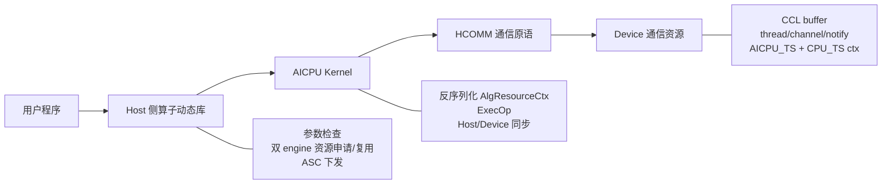
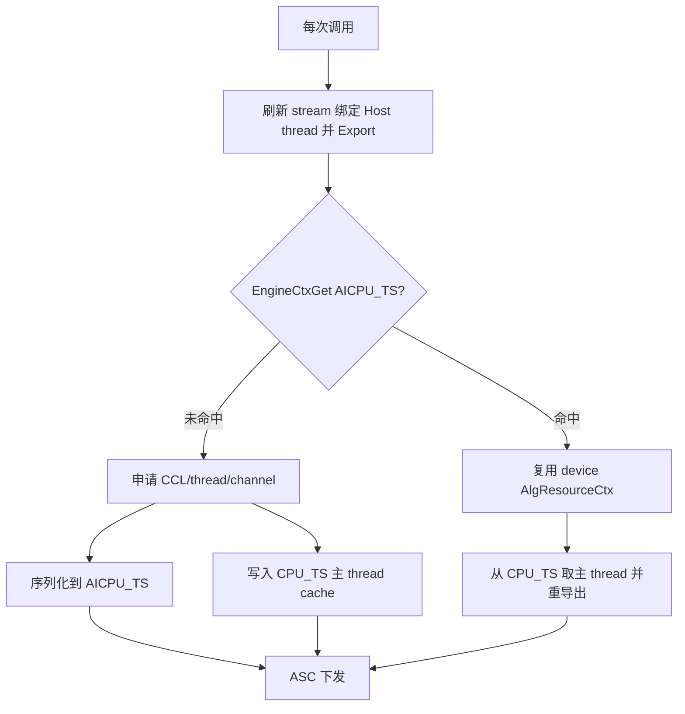
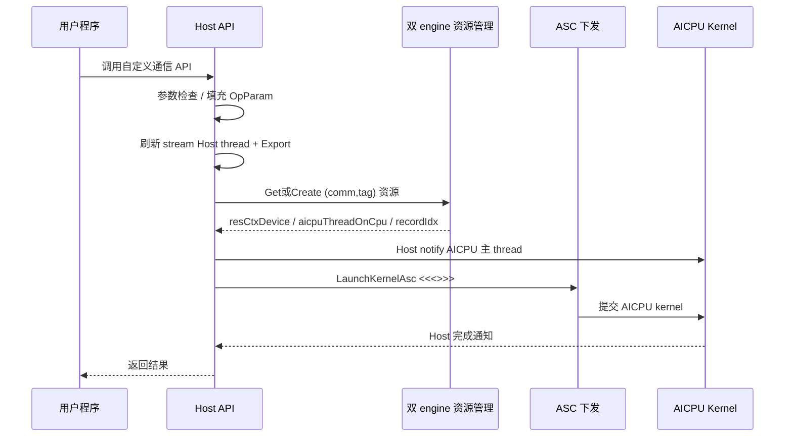
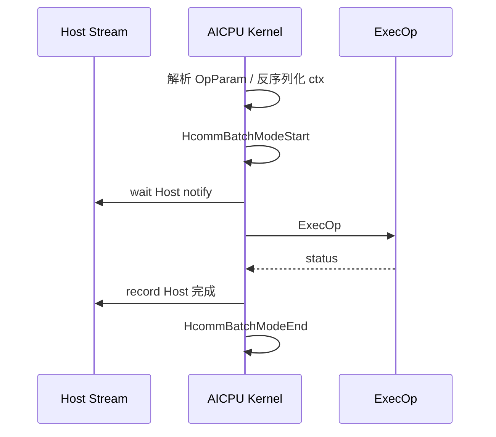

# AICPU 自定义通信算子设计指导文档

> 基于 `examples/05_custom_ops_allgather/aicpu` 抽象，并对照 `examples/04_custom_ops_p2p` 修正资源与平台差异。  
> 目标：指导 Broadcast / ReduceScatter / AllReduce / AllToAll / SendRecv 等自定义通信算子的方案设计、代码组织与评审。

## 0. 串讲版摘要

一句话：**Host 负责参数检查、通信域级资源准备与 ASC 下发；AICPU 负责基于 HCOMM 原语执行通信编排；可复用资源按 `(comm, tag, engine)` 缓存，stream 绑定同步句柄每次调用刷新。**

### 0.1 推荐串讲结构（6 页）

| 页 | 讲什么 | 对应章节 | 听众带走的结论 |
|---|---|---|---|
| 1 | 目标与分层框架（L0~L3） | §1~§3 | 不是“一套 ExecOp 打天下”，而是骨架 + 拓扑 + 算子 + 平台 |
| 2 | 资源真相表：什么能复用、什么必须刷新 | §8 | 双 engine、tag 缓存键、stream thread 每调刷新 |
| 3 | Host / AICPU 时序与 ASC 默认下发 | §9~§11 | 先 notify 再 launch 的窗口约束；BatchMode 成对 |
| 4 | ExecOp、阶段表与 buffer 布局 | §12~§14 | 每算子强制产出阶段表 + notify 索引表 + 字节布局 |
| 5 | 异常、并发与反模式 | §18~§19 | 失败不挂死、同 comm 多 stream 规则、禁止双份算法 |
| 6 | 测试门禁与工程落地 | §15~§17 | 白名单/签名/构建；ASC 路径必须可复现验证 |

### 0.2 评审优先章节

`3`、`7`、`8`、`9`、`11`、`12`、`13`、`14`、`16`、`18`、`19`。

### 0.3 五个硬约束（全文不再重复展开）

1. **控制面 / 数据面分离**：Host 准备资源并 ASC 下发；AICPU 只消费上下文并编排。
2. **资源与调用参数分离**：CCL / thread / channel 可复用；input/output/count/stream 句柄不可进复用 ctx。
3. **ASC 为默认下发路径**：评审与实现默认 `LaunchKernelAsc`；ACLRT 仅作可选兼容，且必须与 ASC **共用同一份 ExecOp 源**。
4. **阶段可评审**：每个算子必须有阶段表、notify 索引表、buffer 字节布局。
5. **失败可收敛**：所有 wait 有 record；BatchMode start/end 成对；异常不得导致对端永久等待。

---

## 1. 文档目的

本文档用于指导基于 HCCL/HCOMM 通信编程接口开发 AICPU 自定义通信算子，并作为设计评审输入。

本文档基于 AllGather AICPU 样例抽象，**不是** AllGather 实现说明书，而是一套可复用的设计框架。框架按 L0~L3 分层；不同算子主要替换 L1 拓扑策略与 L2 算子策略，而不是复制整包 Host/AICPU 胶水代码。

---

## 2. 设计目标

- 支持以独立算子包形式构建、安装和部署。
- Host 侧提供与 HCCL 风格一致的稳定 C API。
- AICPU 侧负责任务编排与 HCOMM 原语调用。
- 通信重资源按通信域复用；stream 绑定同步资源每次调用刷新。
- 算法实现与 Host 控制逻辑解耦，差异收敛到拓扑策略 + `ExecOp`。
- **默认采用 ASC 下发 AICPU kernel**；ACLRT 为可选兼容路径。
- 具备明确的同步模型、资源模型、异常模型和测试验证方法。

非目标（本框架不承诺一次覆盖）：

- 自动选择最优拓扑（Ring/Mesh/Tree）。
- 跨芯片代际无条件兼容（A2/A3/A5 能力在 L3 声明）。
- 多 stream 同 tag 无锁并发（默认需串行化或分 tag）。

---

## 3. 总体架构与分层框架

### 3.1 逻辑层次

```text
用户程序
  |
  | 调用自定义通信 API
  v
Host 侧算子动态库          << 控制面：检查、资源、ASC 下发、Host 同步
  |
  | OpParam + device ctx
  v
AICPU Kernel               << 数据面：反序列化、BatchMode、ExecOp
  |
  | thread / channel / notify / write|read / local copy
  v
HCOMM 通信原语
  |
  v
Device 通信资源（CCL / thread / channel / engine context）
```



### 3.2 分层模板（推荐按此组织方案）

| 层级 | 名称 | 内容 | 谁来改 |
|---|---|---|---|
| L0 | 通用骨架 | API 形态、`OpParam`、双 engine 复用、Host↔AICPU notify、BatchMode、ASC 下发、打包安装 | 所有算子共享 |
| L1 | 拓扑策略 | Mesh / Ring / P2P；thread/channel 数量公式；链路协议 | 按算法拓扑选 |
| L2 | 算子策略 | AllGather / Broadcast / Reduce* / AllToAll / SendRecv 的 `ExecOp`、阶段表、buffer 布局 | 每个算子必写 |
| L3 | 平台差异 | A5 UB_CTP vs A2/A3 HCCS；Write vs Read；是否需要 `HcommAcquireComm` | 按芯片声明 |

**反模式**：把 AllGather Mesh Write 直接当成“通用通信框架”，用 if-else 塞进单个 `ExecOp` 覆盖全部算子。

### 3.3 推荐执行主链路

```text
用户程序
  -> Host API
  -> 参数检查 / 填充 OpParam
  -> 申请并导出 stream 绑定 Host thread（每调刷新）
  -> 创建或复用 (comm, tag) 通信资源（双 engine）
  -> Host notify AICPU 主 thread
  -> ASC 下发 AICPU kernel
  -> AICPU: BatchModeStart -> wait Host -> ExecOp -> notify Host -> BatchModeEnd
  -> Host wait 完成通知
  -> 返回结果
```

---

## 4. 标准目录结构

```text
custom_op/
├── CMakeLists.txt
├── inc/
│   ├── hccl_custom_xxx.h       # 对外 API
│   ├── common.h                # OpParam、AlgResourceCtx、常量
│   ├── binary_stream.h         # 含 vector 的 ctx 序列化（需要时）
│   └── log.h
├── op_host/
│   ├── xxx.cc                  # Host API + InitAicpuResource
│   ├── utils.cc                # thread/channel/CCL 申请
│   ├── load_kernel.cc          # ACLRT 兼容路径加载（可选）
│   ├── launch_kernel.cc        # 下发入口；默认走 ASC
│   ├── launch_kernel_asc.asc   # ASC <<<>>> 封装（默认方案）
│   └── *.h
├── op_kernel_aicpu/
│   ├── aicpu_kernel_asc.aicpu  # ASC AICPU 入口（默认）
│   ├── exec_op.cc / exec_op.h  # 唯一算法实现源（ASC/ACLRT 共用）
│   ├── aicpu_kernel.cc         # ACLRT 入口（可选兼容，只做胶水）
│   └── libcustom_xxx_kernel.json
├── scripts/
│   └── custom_op_check_cfg.xml # AICPU 包签名配置
└── testcase/
    ├── main.cc
    └── Makefile
```

说明：

- `exec_op` 是 L2 的主要差异点；**禁止**在 `aicpu_kernel_asc.aicpu` 与 `exec_op.cc` 各写一份算法。
- `load_kernel` / `aicpu_kernel.cc` 仅服务 ACLRT 兼容；默认评审不依赖其算法逻辑。
- 含 `std::vector` 的 `AlgResourceCtx` 必须用 `binary_stream` 序列化；纯 POD（如简单 P2P）可用固定长度 memcpy，但需在方案中显式选择。

---

## 5. 核心设计原则

- **控制面与数据面分离**：Host 检查、准备、下发；AICPU 编排与搬运。
- **资源与调用参数分离**：见 §8 资源真相表。
- **通信域级资源复用**：缓存键 `(comm, tag, engine)`；stream 不参与缓存键。
- **ASC 默认下发**：`Host API -> LaunchKernel -> LaunchKernelAsc -> AICPU ASC 入口 -> ExecOp`。
- **单一算法源**：ASC 与 ACLRT 入口只做参数解析/同步胶水，算法只在 `exec_op`。

---

## 6. 接口设计

通用 Host C API 形态：

```cpp
HcclResult HcclXxxCustom(
    void *sendBuf,
    void *recvBuf,
    uint64_t count,
    HcclDataType dataType,
    HcclComm comm,
    aclrtStream stream);
```

| 算子 | 典型扩展参数 |
|---|---|
| Broadcast | root rank |
| ReduceScatter / AllReduce | reduce op |
| AllToAll | send/recv 分片描述（counts/displs 或等效） |
| SendRecv | peer rank；建议独立 tag 或方向后缀 |

接口设计必须写清：

- input/output 元素布局与字节大小公式。
- `count` 单位是**元素个数**，不是字节。
- dataType 支持范围与 `SIZE_TABLE` 映射。
- 调用方负责初始化通信域与 stream。
- 返回值与错误码语义。
- 芯片支持范围（例如 AllGather 样例仅 A5）。

---

## 7. 参数模型

### 7.1 实现视图（贴近样例，推荐落地）

实现层只保留两类结构：

```text
OpParam                      # 一次调用参数，禁止跨调用缓存整包
├── tag / commName / opType
├── myRank / rankSize / devType
├── inputPtr / outputPtr / count / dataType / reduceOp...
├── cpuThread                # 本次 stream 绑定 Host thread
├── aicpuThreadOnCpu         # AICPU 主 thread 导出到 CPU 引擎的句柄
├── cpuThreadOnAicpu         # Host thread 导出到 AICPU 引擎（每调刷新）
├── aicpuRecordCpuIdx        # Host->AICPU 同步所用 notify index
└── resCtxDevice / ctxSize   # device 侧 AlgResourceCtx

AlgResourceCtx               # 可复用通信资源（序列化到 device）
├── cclMem
├── notifyNumOnMainThread / slaveThreadNum
├── notifyNumPerThread
├── threads[]
└── channels[]（remoteRank / handle / remoteCclMem / notifyNum）
```

### 7.2 逻辑视图（仅用于评审归类）

可将 `OpParam` 字段按生命周期归类，**不要**再拆成三套真实类型：

| 逻辑类 | 典型字段 | 生命周期 |
|---|---|---|
| 静态标识 | tag、commName、opType、myRank、rankSize、devType、root/peer | 建域后相对固定 |
| 动态输入 | inputPtr、outputPtr、count、dataType、reduceOp | 单次调用 |
| 同步句柄 | cpuThread、cpuThreadOnAicpu、aicpuThreadOnCpu、aicpuRecordCpuIdx | 单次调用刷新或从 host cache 取回后重导出 |
| 资源句柄 | resCtxDevice、ctxSize | 通信域内可复用 |

硬规则：

- `OpParam` 表示一次调用，整包不跨调用缓存。
- `cpuThreadOnAicpu` **禁止**写入可复用 `AlgResourceCtx`（AllGather 正确模式）。
- 不要把算法分支状态（当前 loop、临时 offset）塞进参数结构。

---

## 8. 资源模型

### 8.1 资源真相表（评审必看）

| 资源 | 是否复用 | 存放位置 | 缓存键 / 刷新规则 |
|---|---|---|---|
| CCL buffer | 是 | `AlgResourceCtx` → `COMM_ENGINE_AICPU_TS` | `(comm, tag, AICPU_TS)` |
| AICPU thread 列表 | 是 | 同上 | 同上 |
| channel + remote CCL 信息 | 是 | 同上 | 同上 |
| AICPU 主 thread 句柄 + host sync notify idx | 是 | Host 侧 `AicpuMainThreadCache` → `COMM_ENGINE_CPU_TS` | `(comm, tag, CPU_TS)` |
| stream 绑定 Host thread | **否** | 仅 `OpParam.cpuThread` | 每次 `HcclThreadAcquireWithStream` |
| Host→AICPU 导出句柄 `cpuThreadOnAicpu` | **否** | 仅 `OpParam` | 每次 `HcclThreadExportToCommEngine` |
| input/output 地址 | **否** | 仅 `OpParam` | 单次调用 |

AllGather 参考实现使用**双 engine**：device 资源在 `AICPU_TS`，主 thread 的 host 侧缓存在 `CPU_TS`。新算子若简化为单 engine，必须在方案中论证等价性，并仍遵守“stream thread 不进复用 ctx”。

### 8.2 tag 规范

- tag 是复用键的一部分，建议稳定、显式、可版本化，例如：`hccl_custom_<op>[_<topo>][_vN]`。
- 不同算子、不同拓扑、不兼容的资源布局**不得**共用同一 tag。
- 不要隐式依赖 `commName` 拼接；需要隔离时直接体现在 tag。

### 8.3 申请与复用流程

```text
首次调用:
  申请 CCL / AICPU threads / channels
  规划 notify（含 Host 同步槽位）
  序列化 AlgResourceCtx -> device (AICPU_TS)
  缓存 AicpuMainThreadCache -> host (CPU_TS)

后续调用:
  HcclEngineCtxGet(comm, tag, AICPU_TS) 命中则复用 device ctx
  从 CPU_TS 取回主 thread，重新 Export 到 CPU 引擎
  仍刷新 stream 绑定 Host thread 与 cpuThreadOnAicpu
```



### 8.4 L1 拓扑资源公式（示例）

| 拓扑 | thread 数（示意） | channel 数 | 备注 |
|---|---|---|---|
| Mesh AllGather | `rankSize - 1`（rankSize==1 时为 1） | `rankSize - 1` | 一对一 channel；主 thread 兼同步 |
| P2P | 1 | 1 | 资源更轻；注意 stream thread 刷新 |
| Ring | 通常 1~2 | 通常 1~2 | 需单独阶段表，不套 Mesh |

thread/notify 规划必须写清：

- 主 thread 上：slave 同步 notify + **Host 同步 notify**（如 `aicpuRecordCpuIdx = notifyNumOnMainThread`）。
- 每 channel：至少覆盖 ACK / DATA 等实际使用的 index；预留但未用的 index 要标明。

---

## 9. Host 侧流程设计

```text
HcclXxxCustom
  |
  |-- 1. 参数合法性检查
  |-- 2. 填充 OpParam（含稳定 tag）
  |-- 3. 校验 device type / dataType 支持范围
  |-- 4. 获取 commName / rankId / rankSize
  |-- 5. 申请 stream 绑定 Host thread，并 Export 到 AICPU 引擎
  |-- 6. 创建或复用双 engine 通信资源
  |-- 7. Host notify AICPU 主 thread（指定 aicpuRecordCpuIdx）
  |-- 8. ASC 下发 AICPU kernel
  |-- 9. Host 等待 AICPU 完成通知
  |--10. 失败路径：补偿未消耗 notify / 保证不留对端死等
  `--11. 返回执行结果
```

评审关注点：

- 参数与芯片门禁是否完整。
- 首次创建与复用路径是否对 `cpuThreadOnAicpu` 有一致处理。
- Host/Device notify 是否成对，index 是否来自规划表。
- launch 失败时，步骤 7 已发出的 notify 如何收敛。



---

## 10. ASC Kernel 下发设计（默认方案）

### 10.1 默认路径

```text
launch_kernel.cc
  -> LaunchKernel                # 默认走 ASC
      -> LaunchKernelWithAsc
          -> Host notify AICPU
          -> LaunchKernelAsc（launch_kernel_asc.asc）
              -> HcclLaunchCustomXxxAicpuKernelAsc<<<...>>>
          -> Host wait AICPU
```

ACLRT（`LoadAICPUKernel` + `aclrtLaunchKernelWithConfig`）仅作为可选兼容路径。若保留双路径：

- 默认编译/运行配置必须指向 ASC。
- 两套入口不得复制算法；统一调用 `ExecOp`。
- 测试矩阵必须包含 ASC，且 ASC/ACLRT 结果一致（若兼容路径仍启用）。

### 10.2 同步约定

```text
下发前: Host thread record notify -> AICPU main thread (aicpuRecordCpuIdx)
下发后: Host thread wait notify  <- AICPU main thread
```

ASC 入口建议：

```cpp
__global__ __aicpu__ uint32_t HcclLaunchCustomXxxAicpuKernelAsc(void *args);
```

评审关注点：

- 入口函数声明/定义/JSON（若兼容 ACLRT）一致。
- `<<<>>>` 参数大小为 `sizeof(OpParam)`（或文档声明的打包格式）。
- 下发后检查启动错误（如 `aclrtGetLastError` 等价手段）。
- CMake 启用 ASC/AICPU 语言与目标 arch。

---

## 11. AICPU Kernel 流程设计

```text
AICPU Kernel ASC 入口
  |
  |-- 1. 解析 OpParam
  |-- 2. 反序列化 AlgResourceCtx
  |-- 3. HcommBatchModeStart(tag)
  |-- 4. 等待 Host stream 通知（aicpuRecordCpuIdx）
  |-- 5. ExecOp
  |-- 6. 通知 Host stream 完成
  |-- 7. HcommBatchModeEnd(tag)      # 成功/失败都要尽量走到
  `-- 8. 返回状态
```

设计要求：

- AICPU **不重新申请**通信资源，只消费 Host 准备好的 ctx。
- Host/Device 同步在算法前后成对。
- `BatchModeStart/End` 必须成对；推荐 RAII/统一出口，避免中途 `return` 漏 End。
- 平台若需要（如部分 A2/A3 P2P），在方案中声明 `HcommAcquireComm/ReleaseComm`，不要假装 AllGather 路径万能。



---

## 12. 通信算法抽象（L2）

### 12.1 ExecOp 统一骨架

```text
ExecOp
  |
  |-- 1. 解析算子语义（含 root/peer/reduceOp）
  |-- 2. rankSize==1 快路径
  |-- 3. 计算字节大小与分片（loop）
  |-- 4. 每 loop:
  |       准备阶段 -> 交换阶段 -> 收敛阶段
  |-- 5. 返回状态
```

`ExecOp` 只需回答四个问题：

| 问题 | 抽象 |
|---|---|
| 数据从哪来 | input / 本地 CCL / remote CCL |
| 数据怎么分 | count、slice、layout、offset（字节） |
| 数据怎么同步 | thread notify、channel notify |
| 数据怎么收敛 | 写回 output / reduce 写回 / 局部整理 |

### 12.2 算子差异（阶段策略，不是 Host 分叉）

| 算子 | 阶段差异点 |
|---|---|
| AllGather | 对称交换，按 rank 拼接结果 |
| Broadcast | root 与非 root 行为不同，但阶段顺序仍须对齐 |
| ReduceScatter | 交换后对分片 reduce，再写回本 rank 分片 |
| AllReduce | reduce + 结果对全员可见（可拆 reduce-scatter + allgather） |
| AllToAll | 每个 remote 对应不同分片 |
| SendRecv | 指定 peer；Send/Recv 对称配对，避免单边 wait |

### 12.3 新算子强制产出物（评审门禁）

缺任一则不通过设计评审：

1. **每 rank × 每阶段行为表**（含 root/peer 分支）。
2. **notify 索引分配表**（Host / thread / channel 分区，无冲突）。
3. **input / CCL / output 字节级布局与分片公式**。
4. **`rankSize==1` 与失败回滚说明**。
5. **BatchMode 与 Host notify 成对保证**。

---

## 13. 同步模型

### 13.1 三类同步

| 同步类型 | 作用 |
|---|---|
| Host ↔ AICPU | stream 与 kernel 执行顺序 |
| AICPU thread 间 | 同 rank 多 thread 阶段对齐 |
| rank 间 channel | 跨 rank 写入/读取前后顺序 |

原则：

- 所有 wait 必须有对应 record。
- 所有 rank 的**阶段顺序**一致；允许阶段内角色不同，但不允许阶段集合漂移。
- notify index 集中定义；Host 同步槽位与算法槽位隔离。
- 异常路径评估对端是否死等。

### 13.2 通信阶段表模板

大消息按 **loop 内三段式**，而不是整个算子只有一次三段：

```text
for each slice:
  准备阶段 -> 交换阶段 -> 收敛阶段
```

| 阶段 | 本 rank 行为 | remote 行为 | notify | 数据位置 |
|---|---|---|---|---|
| 准备 | 本地拷贝到 CCL 分片 | 对齐等待 | thread sync | input → CCL |
| 交换 | write/read + 握手 | 配对 wait/record | channel notify | local CCL ↔ remote CCL |
| 收敛 | 写回 output / reduce | 同步执行 | thread sync | CCL → output |

### 13.3 notify 索引表示例（Mesh AllGather）

| 域 | index | 用途 |
|---|---|---|
| channel | 0 | ACK 握手 |
| channel | 1 | DATA 完成信号 |
| channel | 2 | 预留（若不用须标明） |
| main thread（算法） | `0 .. slave-1` | slave 完成同步 |
| main thread（Host） | `notifyNumOnMainThread` | Host↔AICPU 控制同步 |

---

## 14. 数据与 buffer 模型

| buffer | 所属 | 用途 |
|---|---|---|
| input | 用户 | 算子输入 |
| output | 用户 | 算子输出 |
| CCL | 通信域资源 | rank 间中转 |

要求：

- 明确三类 buffer 的元素/字节布局与 offset 公式。
- 分片大小不超过 CCL 可用空间；建议按对齐单位向下取整。
- offset/size 统一用字节，避免 dataType 混淆。
- 大数据必须定义 loop 边界与每 loop 同步。

| 算子 | 主要流转 |
|---|---|
| AllGather | input → 本 rank CCL 槽位 → 交换到各 rank CCL → 按 rank 拼到 output |
| Broadcast | root：input→CCL 并分发；非 root：收 CCL→output（双方阶段对齐） |
| ReduceScatter | input → CCL 交换/归约 → 本 rank 分片写 output |
| AllReduce | input → CCL 归约 → 全量结果写 output |
| AllToAll | input 分片 → 每 remote 对应 CCL 槽位 → output 分片 |
| SendRecv | Send：input→本地/对端可见区；Recv：对端区→output |

---

## 15. 构建、部署与工程闭环

### 15.1 产物

| 产物 | 安装位置 |
|---|---|
| Host 动态库 | `opp/vendors/<vendor>/lib64` |
| 对外头文件 | `opp/vendors/<vendor>/include` |
| AICPU kernel 包 | `opp/vendors/<vendor>/aicpu/kernel` |
| AICPU kernel JSON | `opp/vendors/<vendor>/aicpu/config` |
| 安装脚本/签名配置 | `opp/vendors/<vendor>/scripts` |

### 15.2 构建入口（依赖 HCCL 仓）

```bash
bash build.sh --vendor=cust --ops=<op_name> --custom_ops_path=./path/to/custom_op
```

构建需覆盖：Host 动态库、ASC/AICPU kernel、打包签名、JSON/头文件安装。

### 15.3 安装后必备步骤

1. 安装 run 包到 CANN/自定义 OPP 路径。
2. 将 AICPU 包追加到 `ascend_package_load.ini` 白名单。
3. 按环境要求处理自定义算子签名校验（CMS / `npu-smi` 安全开关策略以现场规范为准）。
4. 运行时保证 Host so 在 `LD_LIBRARY_PATH`（或等价路径）可见。

缺白名单或签名步骤，算子“编译成功但 kernel 不加载”是预期失败，设计文档必须写明。

---

## 16. 测试验证设计

至少覆盖：

- 多卡基础正确性（自动校验，不只打印）。
- `rankSize==1`。
- 不同 count / dataType。
- 超过 CCL 分片阈值的大数据 loop。
- **连续两次调用**验证资源复用（engine ctx 命中，而非复用 stream thread）。
- 多通信域；多 stream（见 §18 并发规则）。
- 非法参数、ASC 下发失败、notify 超时。
- **ASC 默认路径必测**；若保留 ACLRT，增加双路径结果一致性。

建议 testcase 骨架：

```text
ACL 初始化
  -> 每卡线程：创 comm/stream/buffer
  -> 调自定义算子
  -> stream 同步 + 校验
  -> 二次调用验证复用
  -> 释放
```

---

## 17. 设计评审检查清单

### 17.1 架构

- [ ] 是否按 L0~L3 声明差异落点
- [ ] 是否默认 ASC，且 ExecOp 单一源
- [ ] 算法差异是否收敛到拓扑 + ExecOp，而非 Host 分叉

### 17.2 接口

- [ ] API 是否表达完整语义
- [ ] buffer 布局、count 单位、dataType、芯片范围是否明确

### 17.3 资源

- [ ] 是否给出资源真相表
- [ ] 缓存键是否为 `(comm, tag, engine)`
- [ ] stream 绑定句柄是否每调刷新且未进入复用 ctx
- [ ] tag 是否避免跨算子/跨拓扑冲突
- [ ] thread/channel/notify 公式是否与 L1 拓扑匹配

### 17.4 同步与算法

- [ ] 阶段表、notify 索引表、字节布局三者齐全
- [ ] Host/thread/channel notify 均成对
- [ ] root/peer 分支无死锁
- [ ] 分片 loop 与 `rankSize==1` 有方案

### 17.5 ASC 与工程

- [ ] `launch_kernel_asc.asc` / `aicpu_kernel_asc.aicpu` 齐全
- [ ] CMake/arch/ABI 说明齐全
- [ ] 白名单、签名、安装路径、环境变量说明齐全

### 17.6 测试与异常

- [ ] 有自动校验 testcase
- [ ] 覆盖复用、边界、超时、下发失败
- [ ] 异常路径不会对端死等；BatchMode 成对

---

## 18. 异常、并发与生命周期

### 18.1 异常路径最低要求

| 场景 | 要求 |
|---|---|
| Host 已 notify，ASC launch 失败 | 定义补偿或超时回收，避免 AICPU/对端空等 |
| AICPU wait/ExecOp 失败 | 仍尽量 `BatchModeEnd`；向 Host 返回明确错误 |
| 单 rank 失败 | 评估其他 rank 的 wait 是否可超时退出 |
| 资源申请中途失败 | 释放已申请 thread/channel/ctx，不留半初始化缓存 |

### 18.2 并发规则

- 默认：**同一 `(comm, tag)` 上多 stream 并发不安全**（复用 ctx 与 notify 槽位无锁）。
- 可选策略（方案必须三选一写死）：
  1. 文档约束调用方同 tag 串行；
  2. Host 侧按 `(comm, tag)` 加锁；
  3. 每 stream/每并发上下文使用不同 tag（成本更高）。

### 18.3 生命周期

- 复用 ctx 随通信域管理；comm destroy 后不得再持有 device ctx 指针。
- Host 侧 `AicpuMainThreadCache` 与 device ctx 生命周期一致。
- 不要在进程内假设“tag 永久有效”而不处理通信域重建。

---

## 19. 常见设计风险与反模式

| 风险 / 反模式 | 说明 | 规避 |
|---|---|---|
| 缓存 stream 绑定 thread | P2P 旧模式在复用时易坏 | 每调 Acquire+Export；句柄只放 OpParam |
| ASC/C++ 双份算法 | 后同步 index、收敛写回易漂移 | 单一 `exec_op` 源 |
| notify 死锁 | 不成对或分支不对称 | 阶段表逐阶段审配对 |
| CCL 越界 | offset/分片算错 | 字节布局 + 对齐后 bound |
| 复用键过粗 | 多算子共用 tag | tag 含 op/topo/版本 |
| 先 notify 后 launch 失败 | 对端空等 | 失败补偿/超时 |
| BatchMode 漏 End | 后续调用异常 | 统一出口 |
| 把 Mesh AllGather 当万能 | AllToAll/Reduce/P2P 语义不同 | 走 L1/L2 分层 |
| 忽略白名单/签名 | 包装了不加载 | 工程闭环写进方案 |

---

## 20. 新算子开发流程

1. 定义 L2 语义：输入输出、rank 行为、字节布局。
2. 选择 L1 拓扑与 L3 平台能力，给出资源公式。
3. 设计 Host API 与 tag。
4. 产出阶段表、notify 索引表、buffer 布局图。
5. 实现 Host：检查、双 engine 资源、ASC 下发、失败补偿。
6. 实现 AICPU 入口胶水 + 唯一 `ExecOp`。
7. 完成 CMake、JSON、签名与安装说明。
8. 编写 testcase（含二次调用复用与 ASC 路径）。
9. 按 §17 清单评审。

---

## 21. 总结

AICPU 自定义通信算子的正确抽象不是“一个 AllGather 模板打遍所有集合通信”，而是：

- **L0 骨架**保证 Host/AICPU 解耦、ASC 默认下发、双 engine 安全复用；
- **L1/L2** 用拓扑与阶段策略表达算子差异；
- **L3** 显式声明平台差异；
- 用阶段表、notify 索引表、资源真相表和异常/并发规则把方案变成可评审、可测试、可落地的工程设计。

重点始终只有四件事：**复用是否安全、notify 是否成对、buffer/offset 是否正确、多 rank/多路径是否一致。**

---

## 22. 附录：与样例代码的对应关系

| 设计概念 | AllGather AICPU 样例落点 |
|---|---|
| Host API | `op_host/allgather.cc` / `HcclAllGatherCustom` |
| 双 engine 复用 | `InitAicpuResource`：`AICPU_TS` + `CPU_TS` |
| stream thread 刷新 | `HcclThreadAcquireWithStream` + `Export` 每调执行 |
| OpParam / AlgResourceCtx | `inc/common.h` |
| ASC 下发 | `launch_kernel_asc.asc`；设计默认 ASC，兼容路径见 `launch_kernel.cc` |
| ExecOp | `op_kernel_aicpu/exec_op.cc`（应以该源为唯一算法实现） |
| 工程闭环 | 仓根 `build.sh`、白名单、`scripts/*_check_cfg.xml`、README 安装步骤 |

> 说明：历史样例可能默认走 ACLRT 环境变量开关。**本设计文档规定新产品/新算子默认 ASC**；若需与旧样例双路径并存，必须满足“单一 ExecOp 源 + ASC 必测”。
