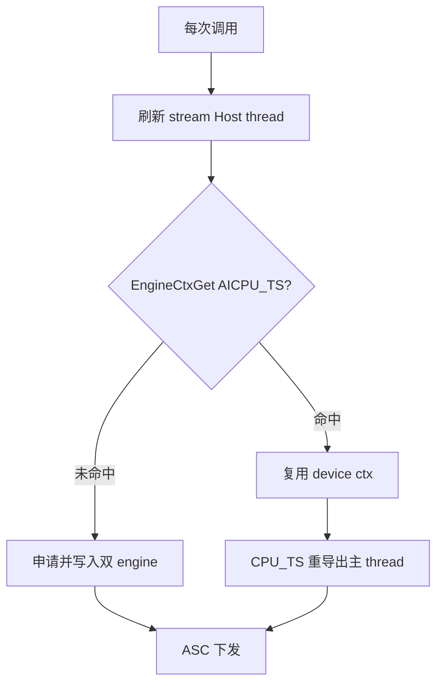
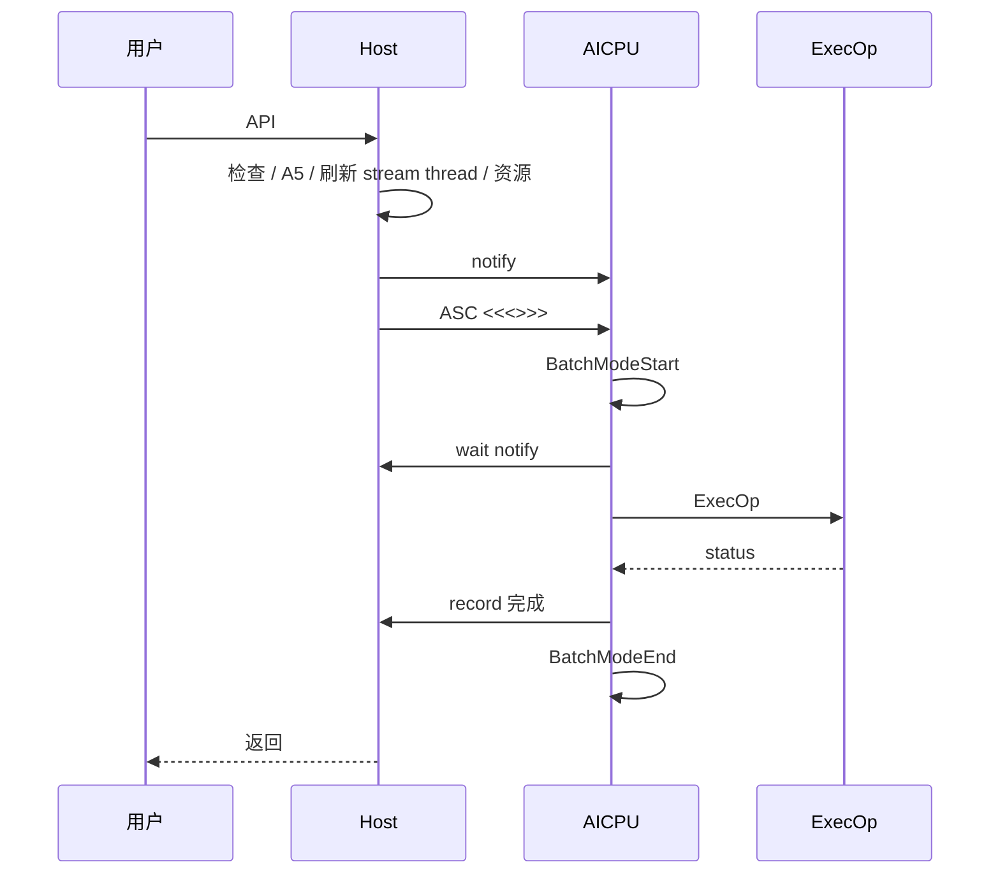

# AICPU 自定义通信算子设计指导文档（Ascend 950 / A5）

> 基于 `examples/05_custom_ops_allgather/aicpu` 抽象。  
> **仅面向 Ascend 950（A5）**，不考虑 A2/A3。  
> 指导 Broadcast / ReduceScatter / AllReduce / AllToAll / SendRecv 等自定义通信算子的方案设计、代码组织与评审。

---

## 0. 串讲摘要、硬约束与范围

一句话：**Host 负责参数检查、通信域级资源准备与 ASC 下发；AICPU 负责基于 HCOMM 原语执行通信编排；可复用资源按 `(comm, tag, engine)` 缓存，stream 绑定同步句柄每次调用刷新。**

### 适用范围

- 芯片：仅 Ascend 950（A5）
- 链路与原语：按 A5 能力使用（如 UB_CTP + Write，以 HCOMM/HCCL A5 接口为准）
- 不讨论 A2/A3 兼容分支或跨代协议差异

### 串讲结构（6 页 = 6 章）

| 页/章 | 标题 | 听众带走的结论 |
|---|---|---|
| 0 | 摘要、硬约束与范围 | A5-only；五条硬约束 |
| 1 | 架构、分层与目录 | L0 骨架 + L1 拓扑 + L2 算子，不是一套 ExecOp 打天下 |
| 2 | 参数与资源模型 | 双 engine、tag 缓存键、stream thread 每调刷新 |
| 3 | 端到端执行链路 | Host → ASC → AICPU → ExecOp；notify/BatchMode 成对 |
| 4 | 同步、阶段表与 buffer | 每算子强制三张表 |
| 5 | 质量与过审 | 异常不挂死；ASC 必测；清单过审 |

### 五条硬约束

1. **控制面 / 数据面分离**：Host 准备资源并 ASC 下发；AICPU 只消费上下文并编排。
2. **资源与调用参数分离**：CCL / thread / channel 可复用；input/output/count/stream 句柄不可进复用 ctx。
3. **ASC 为默认下发路径**：ACLRT 仅可选兼容，且必须与 ASC **共用同一份 ExecOp 源**。
4. **阶段可评审**：每个算子必须有阶段表、notify 索引表、buffer 字节布局。
5. **失败可收敛**：所有 wait 有 record；BatchMode start/end 成对；异常不得导致对端永久等待。

### 目标与非目标

**目标**：A5 上独立算子包构建部署；稳定 Host C API；通信域级资源复用；差异收敛到拓扑 + `ExecOp`；默认 ASC；具备同步/异常/测试方法。

**非目标**：A2/A3 支持；自动选最优拓扑；同 `(comm, tag)` 多 stream 无锁并发。

---

## 1. 架构、分层与目录

### 1.1 逻辑层次与主链路

```text
用户程序
  -> Host 侧算子动态库     << 控制面：检查、资源、ASC 下发、Host 同步
  -> AICPU Kernel          << 数据面：反序列化、BatchMode、ExecOp
  -> HCOMM 通信原语
  -> Device 通信资源（CCL / thread / channel / engine context）
```


```text
Host API -> 填 OpParam -> A5 门禁 -> 刷新 stream Host thread
  -> 创建/复用 (comm, tag) 双 engine 资源
  -> Host notify AICPU -> ASC 下发
  -> AICPU: BatchModeStart -> wait -> ExecOp -> notify Host -> BatchModeEnd
  -> Host wait -> 返回
```

### 1.2 分层模板（L0~L2）

| 层级 | 名称 | 内容 | 谁来改 |
|---|---|---|---|
| L0 | 通用骨架 | API、`OpParam`、双 engine 复用、Host↔AICPU notify、BatchMode、ASC、打包 | 所有算子共享 |
| L1 | 拓扑策略 | Mesh / Ring / P2P；thread/channel 公式；传输原语选型 | 按拓扑选 |
| L2 | 算子策略 | 各算子 `ExecOp`、阶段表、buffer 布局 | 每个算子必写 |

**反模式**：把 AllGather Mesh Write 当成万能框架塞进单个 `ExecOp`。

### 1.3 标准目录与样例映射

```text
custom_op/
├── CMakeLists.txt
├── inc/          # hccl_custom_xxx.h, common.h, binary_stream.h, log.h
├── op_host/      # xxx.cc, utils.cc, launch_kernel.cc, launch_kernel_asc.asc
│                 # load_kernel.cc（ACLRT 可选）
├── op_kernel_aicpu/
│   ├── aicpu_kernel_asc.aicpu
│   ├── exec_op.cc / exec_op.h   # 唯一算法源
│   ├── aicpu_kernel.cc          # ACLRT 胶水（可选）
│   └── *.json
├── scripts/      # 签名配置
└── testcase/
```

| 设计概念 | AllGather AICPU 样例 |
|---|---|
| Host API / A5 门禁 / 双 engine | `op_host/allgather.cc` |
| stream thread 刷新 | 每调 `AcquireWithStream` + `Export` |
| OpParam / AlgResourceCtx | `inc/common.h` |
| ASC 下发 | `launch_kernel_asc.asc` |
| ExecOp | `op_kernel_aicpu/exec_op.cc` |
| 工程闭环 | 仓根 `build.sh`、白名单、`scripts/*_check_cfg.xml` |

- **禁止**在 ASC 入口与 `exec_op.cc` 各写一份算法。
- 含 `std::vector` 的 ctx 用 `binary_stream`；纯 POD 可用 memcpy，须在方案中显式选择。
- 历史样例可能默认 ACLRT；**新算子默认 ASC**，双路径须「单一 ExecOp + ASC 必测」。

---

## 2. 参数与资源模型

### 2.1 Host API（形态）

```cpp
HcclResult HcclXxxCustom(
    void *sendBuf, void *recvBuf, uint64_t count,
    HcclDataType dataType, HcclComm comm, aclrtStream stream);
```

| 算子 | 典型扩展 |
|---|---|
| Broadcast | root rank |
| ReduceScatter / AllReduce | reduce op |
| AllToAll | send/recv 分片描述 |
| SendRecv | peer rank；建议独立 tag |

须写清：布局与字节公式；`count` 为元素个数；dataType 范围；**仅 A5**；错误码。非 A5 直接失败返回。

### 2.2 参数模型

实现层只保留两类结构：

```text
OpParam                      # 一次调用，禁止整包跨调用缓存
├── tag / commName / opType
├── myRank / rankSize / devType   # A5 门禁
├── inputPtr / outputPtr / count / dataType / ...
├── cpuThread / aicpuThreadOnCpu / cpuThreadOnAicpu
├── aicpuRecordCpuIdx
└── resCtxDevice / ctxSize

AlgResourceCtx               # 可复用，序列化到 device
├── cclMem
├── notifyNumOnMainThread / slaveThreadNum / notifyNumPerThread
├── threads[]
└── channels[]（remoteRank / handle / remoteCclMem / notifyNum）
```

逻辑归类（不要再拆三套类型）：静态标识 | 动态输入 | 同步句柄（每调刷新）| 资源句柄（可复用）。

硬规则：`cpuThreadOnAicpu` **禁止**写入可复用 `AlgResourceCtx`。

### 2.3 资源真相表（评审必看）

| 资源 | 复用 | 存放 | 缓存键 / 刷新 |
|---|---|---|---|
| CCL / AICPU threads / channels / remote CCL | 是 | `AlgResourceCtx` → `AICPU_TS` | `(comm, tag, AICPU_TS)` |
| AICPU 主 thread + host sync notify idx | 是 | Host `AicpuMainThreadCache` → `CPU_TS` | `(comm, tag, CPU_TS)` |
| stream Host thread / `cpuThreadOnAicpu` | **否** | 仅 `OpParam` | 每次 Acquire + Export |
| input/output | **否** | 仅 `OpParam` | 单次调用 |

参考实现用**双 engine**；若简化为单 engine 须论证等价性，且 stream thread 仍不得进复用 ctx。

**tag**：`hccl_custom_<op>[_<topo>][_vN]`；不同算子/拓扑/不兼容布局不得共用。

### 2.4 申请与复用

```text
每次: 刷新 stream Host thread 并 Export
首次: 申请 CCL/thread/channel -> 序列化 AICPU_TS -> 写 CPU_TS 主 thread cache
后续: Get AICPU_TS 复用；CPU_TS 取主 thread 重导出；仍刷新 stream 句柄
```



### 2.5 L1 拓扑资源公式（示例）

| 拓扑 | thread（示意） | channel | 备注 |
|---|---|---|---|
| Mesh AllGather | `rankSize-1`（==1 时为 1） | `rankSize-1` | 一对一；主 thread 兼同步 |
| P2P | 1 | 1 | 注意 stream thread 刷新 |
| Ring | 通常 1~2 | 通常 1~2 | 单独阶段表，不套 Mesh |

主 thread 隔离：slave 同步 notify + **Host 同步 notify**（如 `aicpuRecordCpuIdx = notifyNumOnMainThread`）。

---

## 3. 端到端执行链路

### 3.1 Host 主流程

```text
HcclXxxCustom
  1. 参数检查
  2. 填充 OpParam（稳定 tag）
  3. A5 门禁；校验 dataType
  4. 获取 commName / rankId / rankSize
  5. 申请 stream Host thread 并 Export
  6. 创建或复用双 engine 资源
  7. Host notify AICPU（aicpuRecordCpuIdx）
  8. ASC 下发
  9. Host wait 完成通知
 10. 失败补偿（已发 notify 不得留对端死等）
 11. 返回
```

### 3.2 ASC 默认下发

```text
LaunchKernel（默认 ASC）
  -> Host notify AICPU
  -> LaunchKernelAsc / HcclLaunchCustomXxxAicpuKernelAsc<<<...>>>
  -> Host wait AICPU
```

```cpp
__global__ __aicpu__ uint32_t HcclLaunchCustomXxxAicpuKernelAsc(void *args);
```

ACLRT 仅兼容路径。双路径时：默认 ASC；入口只做胶水；算法只在 `ExecOp`；ASC 必测且结果一致。

评审点：入口名一致；参数大小正确；检查启动错误；CMake/ASC arch；launch 失败时步骤 7 的 notify 收敛。

### 3.3 AICPU 入口

```text
ASC 入口
  -> 解析 OpParam / 反序列化 AlgResourceCtx
  -> HcommBatchModeStart(tag)
  -> wait Host notify
  -> ExecOp
  -> notify Host
  -> HcommBatchModeEnd(tag)    # 成功/失败都尽量走到
  -> 返回
```

AICPU **不重新申请**资源；同步成对；BatchMode 用统一出口/RAII。



### 3.4 ExecOp 骨架（L2）

```text
ExecOp
  -> 解析语义（root/peer/reduceOp）
  -> rankSize==1 快路径
  -> 计算字节大小与分片
  -> for each slice: 准备 -> 交换 -> 收敛
  -> 返回
```

| 问题 | 抽象 |
|---|---|
| 数据从哪来 | input / 本地 CCL / remote CCL |
| 数据怎么分 | count、slice、layout、offset（字节） |
| 数据怎么同步 | thread / channel notify |
| 数据怎么收敛 | 写回 output / reduce / 整理 |

| 算子 | 阶段差异 |
|---|---|
| AllGather | 对称交换，按 rank 拼接 |
| Broadcast | root/非 root 角色不同，阶段顺序对齐 |
| ReduceScatter | 交换后分片 reduce，写回本 rank |
| AllReduce | reduce + 全员可见（可拆 RS+AG） |
| AllToAll | 每 remote 不同分片 |
| SendRecv | 指定 peer；Send/Recv 对称配对 |

---

## 4. 同步、阶段表与 buffer

### 4.1 强制产出物（门禁，只列一次）

每个新算子评审必须附：

1. 每 rank × 每阶段行为表（含 root/peer）
2. notify 索引分配表（Host / thread / channel 分区）
3. input / CCL / output 字节布局与分片公式
4. `rankSize==1` 与失败回滚说明
5. BatchMode 与 Host notify 成对保证

### 4.2 三类同步

| 类型 | 作用 |
|---|---|
| Host ↔ AICPU | stream 与 kernel 顺序 |
| AICPU thread 间 | 同 rank 多 thread 阶段对齐 |
| rank 间 channel | 跨 rank 读写前后顺序 |

原则：wait/record 成对；各 rank **阶段顺序**一致；notify index 集中定义；Host 槽位与算法槽位隔离。

### 4.3 阶段表模板（按 loop）

```text
for each slice:
  准备阶段 -> 交换阶段 -> 收敛阶段
```

| 阶段 | 本 rank | remote | notify | 数据位置 |
|---|---|---|---|---|
| 准备 | 拷到 CCL 分片 | 对齐等待 | thread sync | input → CCL |
| 交换 | write/read + 握手 | 配对 wait/record | channel notify | CCL ↔ remote |
| 收敛 | 写回 / reduce | 同步执行 | thread sync | CCL → output |

### 4.4 notify 索引表示例（Mesh AllGather）

| 域 | index | 用途 |
|---|---|---|
| channel | 0 / 1 / 2 | ACK / DATA / 预留（不用须标明） |
| main thread（算法） | `0 .. slave-1` | slave 完成同步 |
| main thread（Host） | `notifyNumOnMainThread` | Host↔AICPU |

### 4.5 Buffer 模型

| buffer | 所属 | 用途 |
|---|---|---|
| input / output | 用户 | 输入输出 |
| CCL | 通信域 | rank 间中转 |

布局与 offset 用字节；分片不超过 CCL 可用空间并对齐。

| 算子 | 主要流转 |
|---|---|
| AllGather | input → 本 rank CCL → 交换 → 按 rank 拼 output |
| Broadcast | root：input→CCL 分发；非 root：CCL→output |
| ReduceScatter | input → CCL 交换/归约 → 本 rank 分片 output |
| AllReduce | input → CCL 归约 → 全量 output |
| AllToAll | input 分片 → 每 remote CCL → output 分片 |
| SendRecv | Send：input→可见区；Recv：对端区→output |

---

## 5. 质量与过审

### 5.1 异常、并发与生命周期

| 场景 | 要求 |
|---|---|
| 非 A5 | Host 直接失败，不下发 |
| Host 已 notify，launch 失败 | 补偿或超时回收 |
| AICPU wait/ExecOp 失败 | 尽量 `BatchModeEnd`；明确错误回 Host |
| 单 rank 失败 | 其他 rank 可超时退出 |
| 资源申请中途失败 | 释放已申请资源，不留半初始化缓存 |

- 默认同一 `(comm, tag)` **多 stream 并发不安全**；须三选一写死：调用方串行 / Host 加锁 / 分 tag。
- ctx 随通信域；comm destroy 后不得再持有；Host cache 与 device ctx 生命周期一致。

### 5.2 反模式（禁止项）

| 禁止 | 正确做法 |
|---|---|
| 缓存 stream 绑定 thread | 每调 Acquire+Export；只放 OpParam |
| ASC/C++ 双份算法 | 单一 `exec_op` |
| notify 不成对 / 分支不对称 | 阶段表逐阶段审 |
| CCL 越界 | 字节布局 + 对齐 bound |
| 多算子共用粗 tag | tag 含 op/topo/版本 |
| 先 notify 后 launch 失败不管 | 失败补偿/超时 |
| BatchMode 漏 End | 统一出口 |
| Mesh AllGather 当万能 | 走 L1/L2 |
| 忽略白名单/签名 | 工程闭环写进方案 |

### 5.3 构建、安装与测试

| 产物 | 安装位置 |
|---|---|
| Host so / 头文件 | `opp/vendors/<vendor>/lib64`、`include` |
| AICPU 包 / JSON | `opp/vendors/<vendor>/aicpu/kernel`、`config` |
| 脚本/签名 | `opp/vendors/<vendor>/scripts` |

```bash
bash build.sh --vendor=cust --ops=<op_name> --custom_ops_path=./path/to/custom_op
```

安装后：白名单 `ascend_package_load.ini`；按规范处理签名；Host so 运行时可见。

**测试至少覆盖**：A5 多卡自动校验；`rankSize==1`；不同 count/dataType；超 CCL loop；**二次调用**验证 engine ctx 复用；多通信域/多 stream（按并发策略）；非法参数与非 A5 门禁；ASC 下发失败与 notify 超时；**ASC 必测**（保留 ACLRT 则双路径一致）。

### 5.4 开发顺序

1. 定义 L2 语义与字节布局  
2. 选 L1 拓扑，给出 thread/channel/notify 公式  
3. 设计 API 与 tag  
4. 产出 §4 强制三张表 + 回滚说明  
5. 实现 Host（A5 门禁、双 engine、ASC、失败补偿）与唯一 `ExecOp`  
6. CMake/JSON/签名/安装说明与 A5 testcase  
7. 按下表过审  

### 5.5 检查清单

**架构与接口**

- [ ] L0~L2 差异落点清晰；默认 ASC；ExecOp 单一源
- [ ] 仅支持 A5；API/布局/count/dataType 明确

**资源**

- [ ] 资源真相表齐全；缓存键 `(comm, tag, engine)`
- [ ] stream 句柄每调刷新且未进复用 ctx；tag 无冲突
- [ ] thread/channel/notify 匹配拓扑

**同步与算法**

- [ ] 阶段表、notify 索引表、字节布局齐全
- [ ] Host/thread/channel notify 成对；root/peer 无死锁
- [ ] 分片 loop 与 `rankSize==1` 有方案

**质量与工程**

- [ ] 异常不致对端死等；BatchMode 成对；并发策略写死
- [ ] A5 自动校验；复用/边界/超时/失败路径；ASC 必测
- [ ] 白名单、签名、安装路径、环境变量齐全
