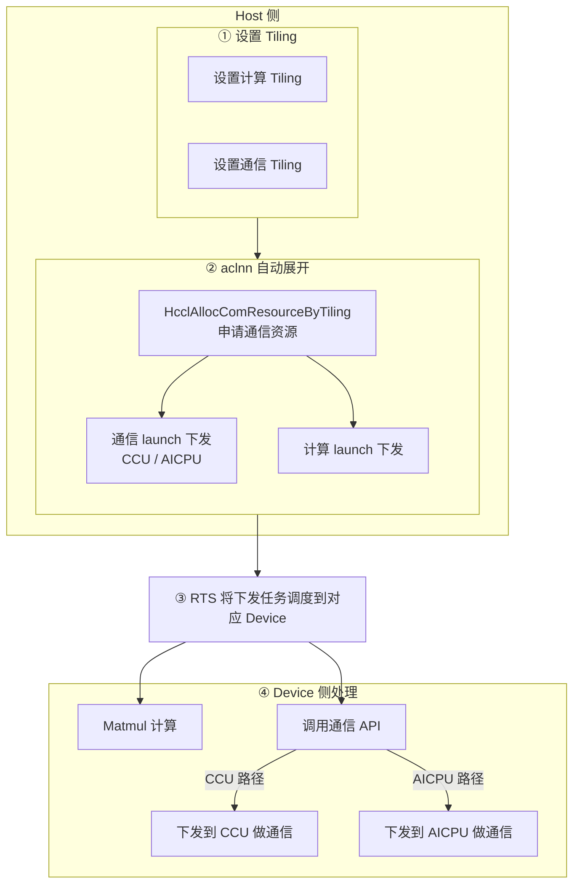
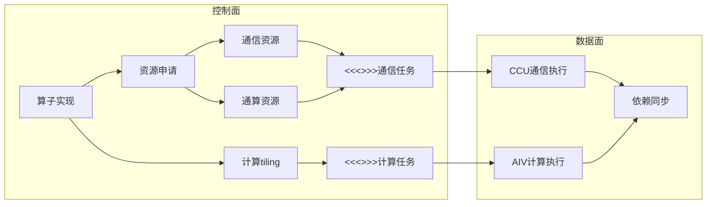
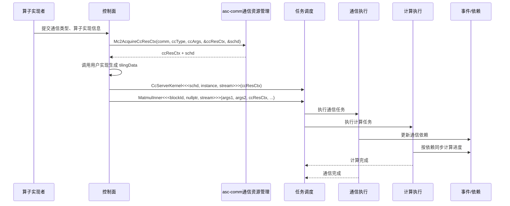

# 通算融合设计文档

## 目录

- [1. 目前实现方式](#1-目前实现方式)
  - [当前实现流程图](#当前实现流程图)
- [2. 问题与方案](#2-问题与方案)
  - [2.1 存在的问题](#21-存在的问题)
  - [2.2 解决方案](#22-解决方案)
- [3. 总体架构](#3-总体架构)
- [4. 关键对象与职责边界](#4-关键对象与职责边界)
- [5. 接口设计](#5-接口设计)
  - [5.1 ccArgs 配置接口](#51-ccargs-配置接口)
  - [5.2 通信资源申请](#52-通信资源申请)
    - [5.2.1 按通信算子粒度申请资源接口（备选）](#521-按通信算子粒度申请资源接口备选)
  - [5.3 控制面任务下发调度](#53-控制面任务下发调度)
- [6. 交互图](#6-交互图)
- [7. 实现 Demo](#7-实现-demo)

## 1. 目前实现方式

### 单算子或是动态图模式

a) OpDef指定.MC2().HcclGroup(group)

b) 控制面设置计算和通信Tiling，Mc2InitTiling需要放到第一个位置,后面放通信和计算的Tiling

c) aclnn展开时，在nnopbase中调用HcclAllocResByTiling申请资源，设置Context(SetHcclContext接口)，分别下发aic launch和aicpu launch

d) 数据面使用时显式调用GetHcclContext接口，获取Context，之后做通算编排

### 静态图模式

静态 shape 图模式无法用 aclnn 执行，需要以在线编译生成 task 的方式支持加载执行。每个算子在图模式场景下需要显式实现 GenTask，GenTask 交付件主要处理两个内容：

a）通信域上下文参数；  
b）存在通信 API、依赖 KFC（AICPU 任务）去完成通信任务的，创建通信任务；

### 当前实现流程图

以单算子 / 动态图模式为例，当前实现按 Host 设置 Tiling、aclnn 自动展开、RTS 调度、Device 侧通算执行四个阶段串起来：

1. **Host 侧：设置 Tiling**  
   控制面分别设置计算 Tiling 和通信 Tiling。`Mc2InitTiling` 需放在首位，其后依次放置通信 Tiling 和计算 Tiling。

2. **Host 侧：aclnn 自动展开**  
   aclnn 在 nnopbase 中完成自动展开，主要包括：
   - 调用 `HcclAllocComResourceByTiling` 申请通信资源；
   - 通信 launch 下发（CCU / AICPU）；
   - 计算 launch 下发。

3. **RTS 调度**  
   下发的计算任务和通信任务由 RTS 调度到对应 Device。

4. **Device 侧处理**  
   Device 上执行 Matmul 计算，并调用通信 API 完成通信：CCU 路径下发到 CCU 做通信，AICPU 路径下发到 AICPU 做通信。



## 2. 问题与方案


### 2.1 存在的问题

a) 隐式输入的问题；

b) 静态图模式需要显式写 GenTask；  
   [需求建议：MC2 算子自定义需要新增 GenTask 交付件，该交付件增加了开发者算子编写和维护难度](https://gitcode.com/cann/ops-transformer/issues/286)

c) 其他模式是在 nnopbase 隐式下发 aic 和 ccu/aicpu 任务。

### 2.2 解决方案

支持通信作为单独的算子下发，用户单独下发通算中的计算和通信任务。

## 3. 总体架构




## 4. 关键对象与职责边界


| 对象         | 生成方                  | 消费方                        | 生命周期                                 | 说明                               |
| ---------- | -------------------- | -------------------------- | ------------------------------------ | -------------------------------- |
| `ccArgs`   | 控制面                  | 通信资源申请                     | `Mc2GetCcArgs` 创建，`Mc2FreeCcArgs` 释放 | 通信资源配置载体，包含算法、通信引擎、数据类型、规约类型等配置。 |
| `ccResCtx` | `Mc2AcquireCcResCtx` | `CcServerKernel`、计算 kernel | 绑定 `HcclComm`，随通信域销毁隐式回收             | 通信资源句柄，用于 CCU 通信任务下发。            |
| `schd`     | `Mc2AcquireCcResCtx` | `CcServerKernel<<<>>>`     | 接口内部管理其生命周期                          | 通信任务下发模板，描述 CCU mission 数量和执行位置。 |


## 5. 接口设计


### 5.1 ccArgs 配置接口

`ccType`、`commEngine`、`srcDataType`、`dstDataType` 和 `reduceType` 均保留后续扩展空间，不收敛为枚举。其中 `srcDataType`、`dstDataType`、`reduceType` 在统一 `ccArgs` 接口中为可选配置；在按算子粒度拆分的备选接口中，是否平铺为显式入参由具体通信算子语义决定。

```c
Mc2Result Mc2GetCcArgs(void **ccArgs);
Mc2Result Mc2FreeCcArgs(void *ccArgs);
Mc2Result Mc2SetCcAlgConfig(void *ccArgs, char *algConfig);
Mc2Result Mc2SetCcCommEngine(void *ccArgs, uint8_t commEngine);
Mc2Result Mc2SetCcSrcDataType(void *ccArgs, uint8_t srcDataType);
Mc2Result Mc2SetCcDstDataType(void *ccArgs, uint8_t dstDataType);
Mc2Result Mc2SetCcReduceType(void *ccArgs, uint32_t reduceType);
```


### 5.2 通信资源申请

```c
Mc2Result Mc2AcquireCcResCtx(HcclComm comm, uint8_t ccType, void *ccArgs, void **ccResCtx, void **schd);

typedef struct {
    uint32_t numBlocks;   // ccu通信时的mission个数
    uint32_t reserve;     // 对齐预留
    uint32_t phyDieMask;  // 在哪个物理die上执行
} HcommCcuSchd;
```

`Mc2AcquireCcResCtx` 参数说明：

- `comm`：通信域句柄；
- `ccType`：通信类型：AllGather、AllReduce、ReduceScatter、AllToAll、AllToAllV 等；
- `ccArgs`：获取资源的配置：`commEngine`、`alg` 等；
- `ccResCtx`：出参，通信资源句柄；
- `schd`：出参，通信资源下发时定义的模板；结构体定义见上文 `HcommCcuSchd`；


#### 5.2.1 按通信算子粒度申请资源接口（备选）

当前推荐以统一 `Mc2AcquireCcResCtx` 作为主接口，按通信算子粒度拆分的接口作为备选方案，用于通信算子参数差异进一步扩大时演进。

除统一的 `Mc2AcquireCcResCtx` 接口外，也可以按通信算子粒度提供独立的资源申请接口。该方式通过函数名表达通信类型，不再额外传入 `ccType`，同时将 `ccArgs` 中的配置项平铺为接口入参。

```c
Mc2Result Mc2AcquireAllGatherCcResCtx(HcclComm comm, char *algConfig, uint8_t commEngine, void **ccResCtx, void **schd);
Mc2Result Mc2AcquireAllReduceCcResCtx(HcclComm comm, char *algConfig, uint8_t commEngine, uint8_t srcDataType, uint8_t dstDataType, uint32_t reduceType, void **ccResCtx, void **schd);
Mc2Result Mc2AcquireReduceScatterCcResCtx(HcclComm comm, char *algConfig, uint8_t commEngine, void **ccResCtx, void **schd);
Mc2Result Mc2AcquireAllToAllCcResCtx(HcclComm comm, char *algConfig, uint8_t commEngine, void **ccResCtx, void **schd);
Mc2Result Mc2AcquireAllToAllVCcResCtx(HcclComm comm, char *algConfig, uint8_t commEngine, void **ccResCtx, void **schd);
```

按算子粒度拆分接口的特点：

- 接口语义更直接，调用方不需要显式维护 `ccType` 取值。
- 每个接口内部映射到对应通信类型，资源申请、调度模板生成和生命周期管理仍保持一致。
- `AllGather`、`ReduceScatter`、`AllToAll`、`AllToAllV` 平铺 `algConfig` 和 `commEngine`。
- `AllReduce` 额外平铺 `srcDataType`、`dstDataType` 和 `reduceType`。
- 适合通信算子参数差异继续扩大时扩展；若各通信算子资源申请流程差异较小，统一接口更利于收敛接口数量。


### 5.3 控制面任务下发调度

资源申请完成后，由控制面统一进行任务下发调度，负责同时下发通信任务和计算任务。任务下发格式必须保持固定的 `<<<>>>` 方式，不做封装替换：

```c
CcServerKernel<<<schd, instance, stream>>>(ccResCtx);

MatmulInner<<<blockId, nullptr, stream>>>(args1, args2, ccResCtx, ...);
```

其中 `args1`、`args2` 等 `void *` 形参保持不变，具体内容由算子实现者约定并在控制面完成校验。

## 6. 交互图

以下交互图以统一通信资源申请接口作为主流程示例。




## 7. 实现 Demo

下面给出一个简化示例，展示资源申请后直接进入统一任务调度。

Demo 基于统一通信资源申请接口展示主流程，未展开按算子粒度备选接口。
示例代码风格参考当前目录 `hccl-master` 中的实现，保持 4 空格缩进、K&R 风格大括号和 HCCL 常见命名方式。
示例中的常量只用于表达调用关系，不代表真实枚举值或完整初始化流程。

```c
typedef struct {
    const void *a;
    const void *b;
    void *c;
    uint32_t m;
    uint32_t n;
    uint32_t k;
} MatmulArgs;

Mc2Result RunAllReduceMatmul(HcclComm comm, aclrtStream stream,
    const MatmulArgs *matmulArgs) {
    void *ccArgs = NULL;
    void *ccResCtx = NULL;
    void *tilingData = NULL;
    void *schd = NULL;
    const uint32_t kInstance = 1;
    const uint32_t kBlockId = 1;
    const uint8_t kAllReduce = ALL_REDUCE;
    const uint8_t kCommEngineDefault = CCU;
    const char *kFullMeshAlg = "fullmesh";
    void *args1 = (void *)matmulArgs->a;
    void *args2 = (void *)matmulArgs->b;
    void *output = matmulArgs->c;

    Mc2GetCcArgs(&ccArgs);
    Mc2SetCcAlgConfig(ccArgs, (char *)kFullMeshAlg);
    Mc2SetCcCommEngine(ccArgs, kCommEngineDefault);
    Mc2AcquireCcResCtx(comm, kAllReduce, ccArgs, &ccResCtx, &schd);
    Mc2FreeCcArgs(ccArgs);

    // BuildTiling 由算子实现者提供，用于生成计算侧 tiling 数据。
    BuildMatmulTiling(&tilingData);

    CcServerKernel<<<schd, kInstance, stream>>>(ccResCtx);
    MatmulInner<<<kBlockId, nullptr, stream>>>(args1, args2, ccResCtx, tilingData, output);

    

    return MC2_SUCCESS;
}
```
